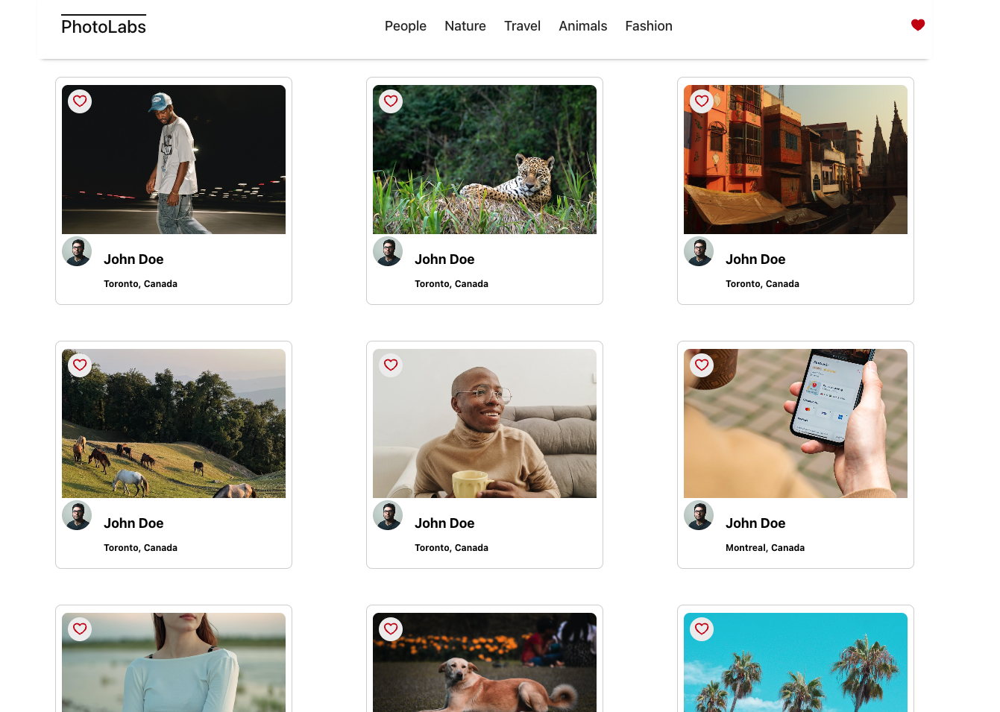
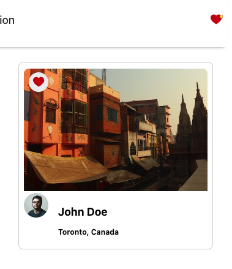
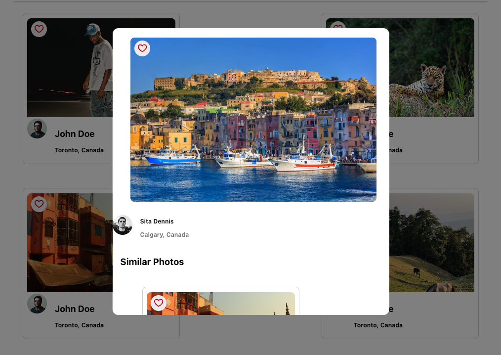

# Photolabs

Photolabs is a Single Page Application (SPA) that allows users to browse a variety of photos, interact by liking and unliking images, and view photos in an enlarged mode with the ability to scroll through similar images.

## Features

- Browse a collection of photos categorized by topics.
- Like and unlike photos to personalize your experience.
- Click on a photo to enlarge it and view it in detail.
- Seamlessly scroll through similar photos while in enlarged mode.

## Libraries Used

- **React**: For building the user interface and handling the view layer.
- **Webpack**: For bundling the client-side assets.
- **Babel**: For transpiling modern JavaScript features.
- **Express.js**: For building the API server and managing requests.
- **PostgreSQL**: For storing and retrieving photo and topic data.

## Screenshots



Favoriting pictures you like!

Getting all the photo details with references to similar photos

## Setup

Follow these steps to set up and run the project locally.

**Note**- Two different servers will be running during development:

The client-side Webpack development server.
The API server to provide photo data.

**Frontend Setup** - ``` cd frontend ```
**Run the Development Server** -  ``` npm run dev ```
You can visit the running application at [http://localhost:3000](http://localhost:3000)

You can run the linter and jest tests with the following commands:

``` npm lint ```
``` npm test ```

**Backend Setup** - ``` cd backend ```

Instructions for backend can be seen here [backend/README.md](backend/README.md)


